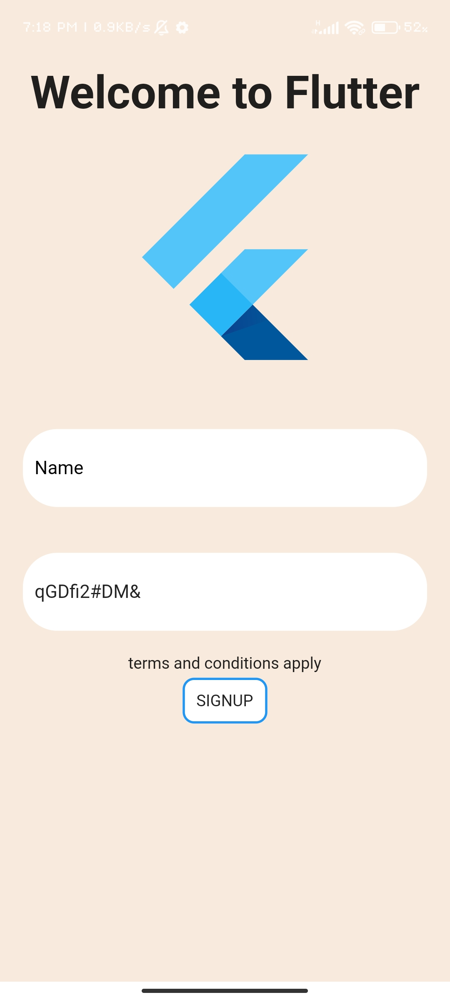

# Description

A package that helps to suggest a strong password at login screen when a new user sign up.

## Features

you can specify the length of the password

## Getting started

 Import the package

  ```dart
import 'package:password_maker/password_maker.dart';
```

### Depend on it

## Example YAML Configuration

```yaml
dependencies:
  password_maker: ^0.0.2
```

## Usage

assign a String for Storing the generated Password, in this case 'temp',then call generatePassWord(length of the password).

```dart
 late String temp; //initializing a temporary (temp) String
  @override
  void initState() {
    super.initState();
    temp=generatePassWord(10);//assigning the temp with generatePassword(10), where 10 is the length of the password, 
    //assigning the temp to the Password controller
    _PasswordController = TextEditingController(text: temp);
  }

//disposing the controllers
  @override
  void dispose() {
    _PasswordController.dispose();
    super.dispose();
  }
```

## ScreenShots from Example




## Additional information

Detailed explanation available in sample App
Sample app named'login_sample',
repository= <https://github.com/josephjose1234/login_sample>
